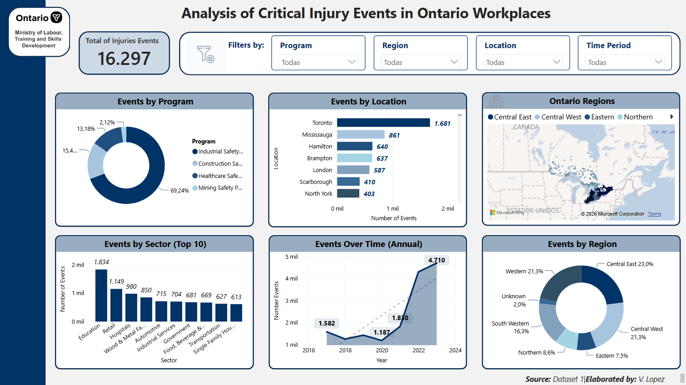

# Power BI Report Template (.pbit) - Analysis of Critical Injury Events in Ontario Workplaces

This repository contains a Power BI Report Template (`.pbit`) designed under a **"Simplicity-First"** layout philosophy, focusing on executive clarity, balanced visual hierarchy, and fast decision-making.

## 📌 Key Features
- **Executive Grid Layout:** Upper-level KPI cards, clear visual distribution, and standardized sectioning.
- **Controlled Palette:** Dark navy headers with slate-blue accents to minimize cognitive clutter.
- **Streamlined Filtering:** Top filter bar supporting multi-slice analysis (Program, Region, Location, Time Period).
- **Core Visuals:** Annual progression trends, sector distribution bar charts, and geographical mapping container.

## 🛠️ How to Use This Template
1. Download the `.pbit` file from this repository.
2. Open the file in **Power BI Desktop**.
3. Re-point the data queries (Power Query) to your own dataset/schema with matching field names, or adjust the underlying tables to map your data.
